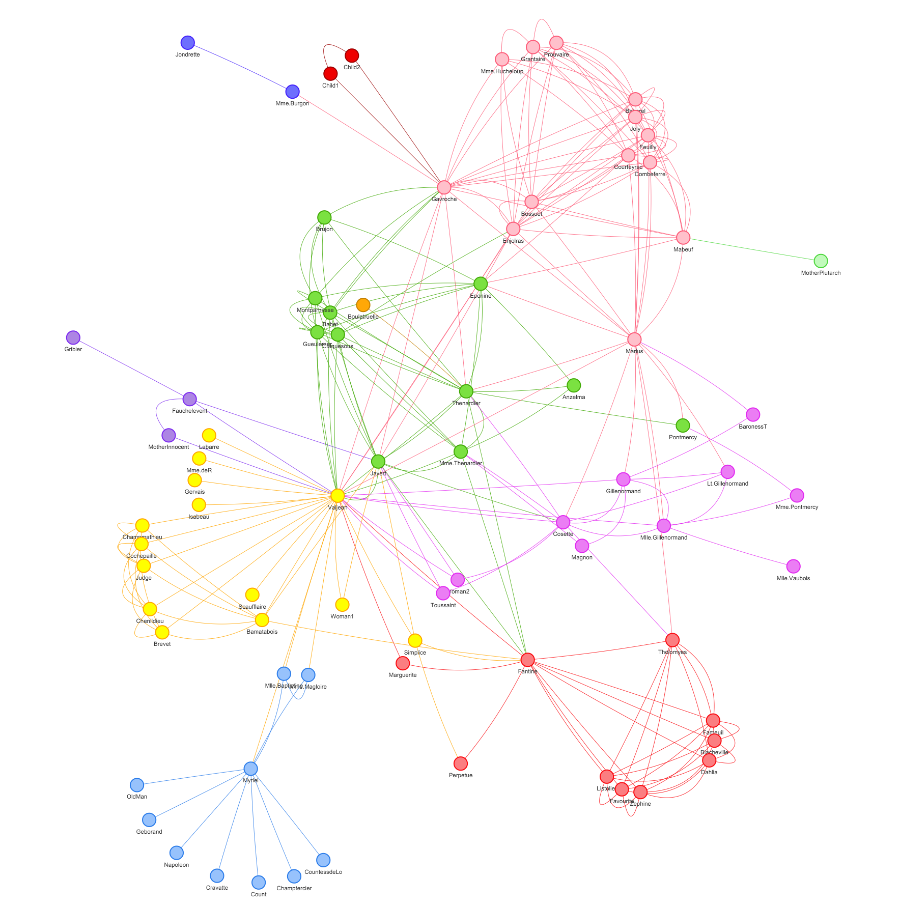

<<<<<<< HEAD
<<<<<<< HEAD


# React/Sass/Redux Boilerplate

Boilerplate and guide for a React/Sass/Redux build.

## Getting Started

To get started, first install all the necessary dependencies.
```
> npm install
```

Run an initial webpack build
```
> webpack
```

Start the development server (changes will now update live in browser)
```
> npm run start
```

To view your project, go to: [http://localhost:3000/](http://localhost:3000/)

## Links

- [Donate](https://www.patreon.com/thenewboston)
- [thenewboston.com](https://thenewboston.com/)
- [Facebook](https://www.facebook.com/TheNewBoston-464114846956315/)
- [Twitter](https://twitter.com/bucky_roberts)
- [Google+](https://plus.google.com/+BuckyRoberts)
- [reddit](https://www.reddit.com/r/thenewboston/)
=======
# React graph vis

A React component to display beautiful network graphs using vis.js

Make sure to visit [visjs.org](http://visjs.org) for more info.

This package allows to render network graphs using vis.js.

Rendered graphs are scrollable, zoomable, retina ready, dynamic, and switch layout on double click.




    var Graph = require('react-graph-vis');

    var data = {
      nodes: [
          {id: 1, label: 'Node 1'},
          {id: 2, label: 'Node 2'},
          {id: 3, label: 'Node 3'},
          {id: 4, label: 'Node 4'},
          {id: 5, label: 'Node 5'}
        ],
      edges: [
          {from: 1, to: 2},
          {from: 1, to: 3},
          {from: 2, to: 4},
          {from: 2, to: 5}
        ]
    };

    React.render(<Graph graph={data}/>, document.body);
>>>>>>> 437c01a961bbc42c2baeb469d56235dff546c4b8
=======
# vij
>>>>>>> 8691beb86c5cec6d374f50a2ec1d8f7216d02105
